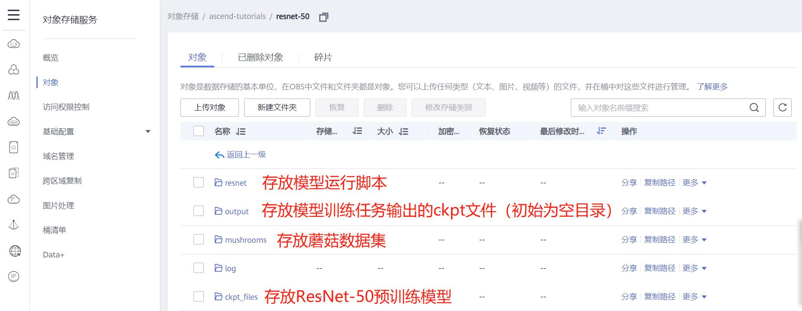
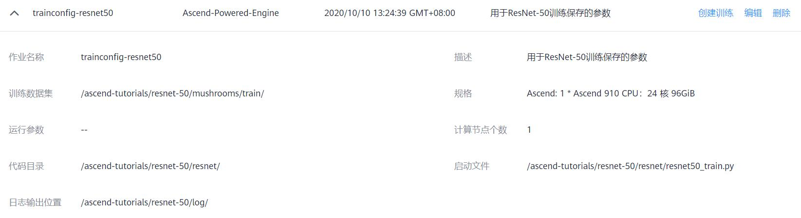
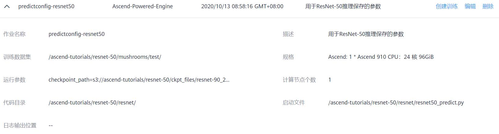

# MindSpore ResNet-50毒蘑菇识别教程指导（Ascend环境）

该教程旨在指导大家通过[ModelArts云服务](https://www.huaweicloud.com/product/modelarts.html)完成MindSpore ResNet-50毒蘑菇识别的教程。

> **注意：** 该教程的代码是基于`v0.5`版本的MindSpore [ModelZoo](https://gitee.com/mindspore/mindspore/tree/r0.5/model_zoo/resnet)开发完成的。

## 上手指导

### 数据准备

* 下载蘑菇数据集

    ```
    cd mushroom-dataset/ && wget https://ascend-tutorials.obs.cn-north-4.myhuaweicloud.com/resnet-50/mushrooms/mushrooms.zip
    unzip mushrooms.zip && rm mushrooms.zip
    ```

    或者您可以直接点击 [https://ascend-tutorials.obs.cn-north-4.myhuaweicloud.com/resnet-50/mushrooms/mushrooms.zip](https://ascend-tutorials.obs.cn-north-4.myhuaweicloud.com/resnet-50/mushrooms/mushrooms.zip) 从浏览器中下载该数据集，手动解压。

* 下载ResNet-50预训练模型（推理任务使用）

    ```
    cd ../resnet_ascend/ckpt_files && wget https://ascend-tutorials.obs.cn-north-4.myhuaweicloud.com/resnet-50/ckpt_files/resnet-90_209.ckpt
    ```

    或者您可以直接点击 [https://ascend-tutorials.obs.cn-north-4.myhuaweicloud.com/resnet-50/ckpt_files/resnet-90_209.ckpt](https://ascend-tutorials.obs.cn-north-4.myhuaweicloud.com/resnet-50/ckpt_files/resnet-90_209.ckpt) 从浏览器中下载预训练模型。

* 将数据集、预训练模型以及源代码上传到OBS服务

    请将前面下载的蘑菇数据集、预训练模型和源代码上传到[华为OBS云服务](https://www.huaweicloud.com/product/obs.html)，上传格式如下：

    

### 模型训练

首先，用户需要手动配置训练任务的参数，格式如下：



然后根据如下视频启动ModelArts训练任务：

[观看视频](https://ascend-tutorials.obs.cn-north-4.myhuaweicloud.com/resnet-50/demo/resnet50_train_demo.mp4)

### 模型推理

首先，用户需要手动配置推理任务的参数，格式如下：



然后根据如下视频启动ModelArts推理任务：

[观看视频](https://ascend-tutorials.obs.cn-north-4.myhuaweicloud.com/resnet-50/demo/resnet50_predict_demo.mp4)

## 许可证

[Apache License 2.0](../../LICENSE)
