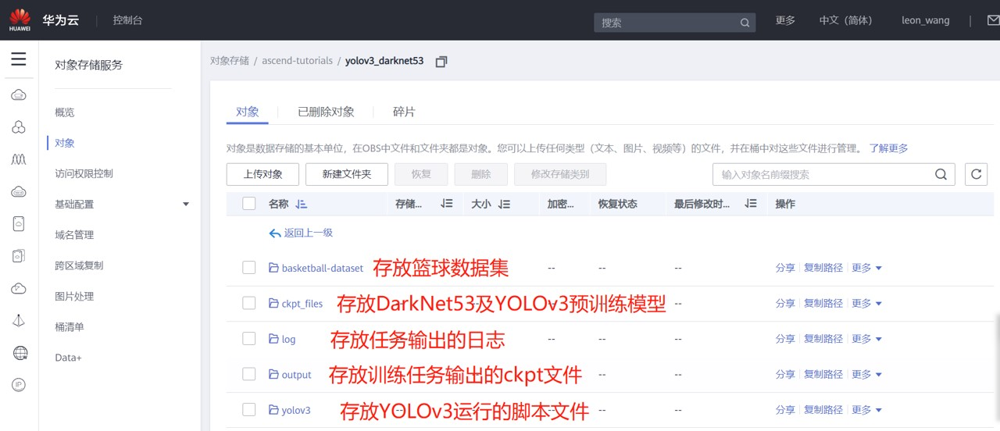
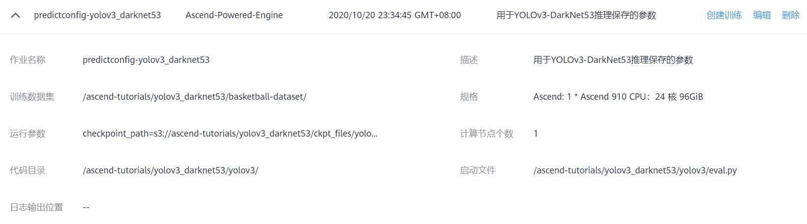
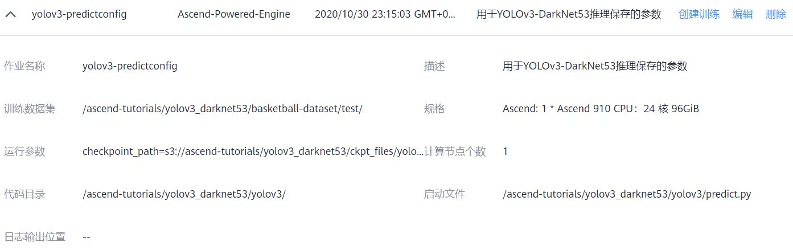
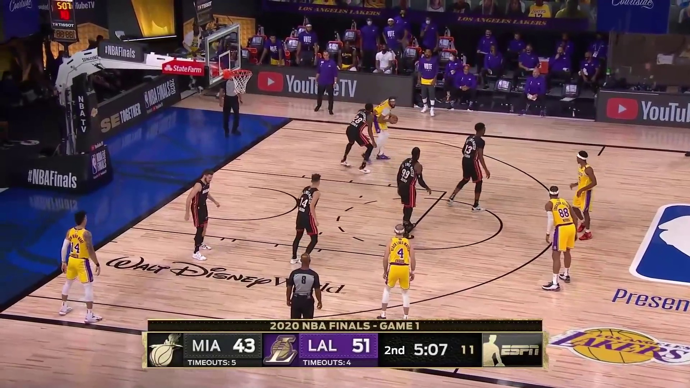

# MindSpore YOLOv3-DarkNet53篮球检测教程指导（Ascend环境）

该教程旨在指导大家通过[ModelArts云服务](https://www.huaweicloud.com/product/modelarts.html)完成MindSpore YOLOv3-DarkNet53篮球检测的教程。

> **注意：** 该教程的代码是基于`v0.5`版本的MindSpore [ModelZoo](https://gitee.com/mindspore/mindspore/tree/r0.5/model_zoo/yolov3_darknet53)开发完成的。

> **注意：** 考虑到预训练过程会占用大量时间，本次课程我们不会提供完整的数据集用于模型训练，但我们会提供YOLOv3预训练模型以及测试数据集，方便大家用于模型验证和推理工作。

## 上手指导

### 数据准备

* 下载测试数据集（验证任务使用）

    ```
    cd basketball-dataset/ && wget https://ascend-tutorials.obs.cn-north-4.myhuaweicloud.com/yolov3-darknet53/basketball-dataset/basketball-dataset.zip
    unzip basketball-dataset.zip && rm basketball-dataset.zip
    ```

    或者您可以直接点击 [https://ascend-tutorials.obs.cn-north-4.myhuaweicloud.com/yolov3_darknet53/basketball-dataset/basketball-dataset.zip](https://ascend-tutorials.obs.cn-north-4.myhuaweicloud.com/yolov3_darknet53/basketball-dataset/basketball-dataset.zip) 从浏览器中下载该数据集，手动解压。

* 下载YOLOv3-DarkNet53预训练模型（验证/推理任务使用）

    ```
    cd ../resnet_ascend/ckpt_files && wget https://ascend-tutorials.obs.cn-north-4.myhuaweicloud.com/yolov3_darknet53/ckpt_files/yolov3-320_168000.ckpt
    ```

    或者您可以直接点击 [https://ascend-tutorials.obs.cn-north-4.myhuaweicloud.com/yolov3_darknet53/ckpt_files/yolov3-320_168000.ckpt](https://ascend-tutorials.obs.cn-north-4.myhuaweicloud.com/yolov3_darknet53/ckpt_files/yolov3-320_168000.ckpt) 从浏览器中下载预训练模型。

* 将数据集、预训练模型以及源代码上传到OBS服务

    请将前面下载的篮球数据集、预训练模型和源代码上传到[华为OBS云服务](https://www.huaweicloud.com/product/obs.html)，上传格式如下：

    

### 模型验证

首先，用户需要手动配置验证任务的参数，格式如下：



然后根据如下视频启动ModelArts训练任务：

[观看视频](https://ascend-tutorials.obs.cn-north-4.myhuaweicloud.com/yolov3_darknet53/demo/yolov3_eval_demo.mp4)

### 模型推理

首先，用户需要手动配置推理任务的参数，格式如下：



然后根据如下视频启动ModelArts推理任务：

[观看视频](https://ascend-tutorials.obs.cn-north-4.myhuaweicloud.com/yolov3_darknet53/demo/yolov3_predict_demo.mp4)

输入图片：



输出结果：


## 许可证

[Apache License 2.0](../../LICENSE)
